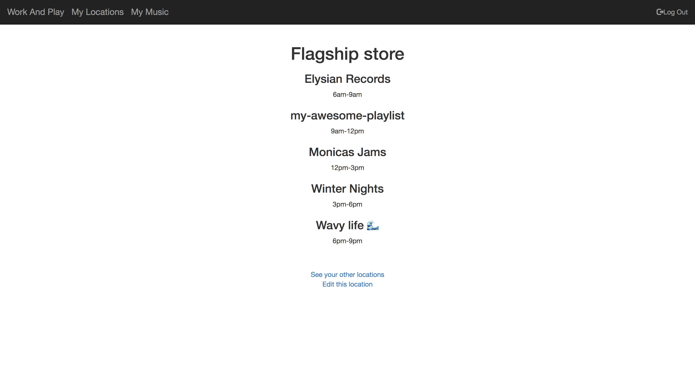
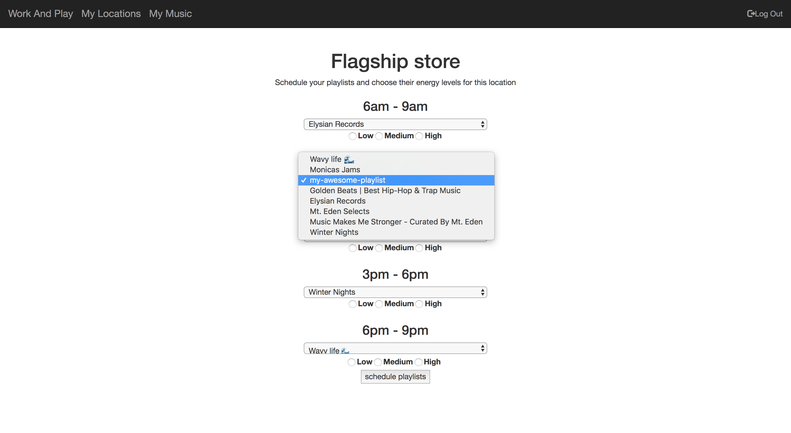
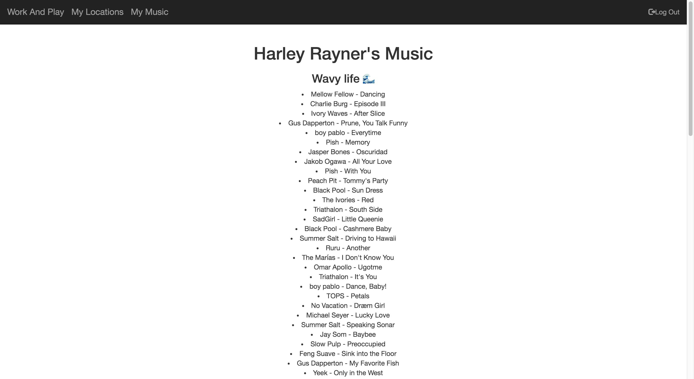

# work-and-play

A "background music" app that allows businesses to easily curate the workplace mood with music in multiple locations using built-in and imported playlists

## Motivation
For many businesses, setting the right mood is very important. Choosing the right music can have a huge impact on customer experience. Yet store managers and owners often leave the music-choosing to whichever employees are working at the time.

This can be a risky proposition, especially in highly optimized environments like clothing stores and supermarkets. To try to maintain an appropriate musical environment conducive to commerce, employees often spend valuable on-the-clock time selecting and changing music to try to maintain an appropriate environment (guilty as charged!).

Why not automate your playlists on a schedule instead?

## Screenshots

## Tech/framework used

<b>Built with</b>
- [Ruby On Rails](https://rubyonrails.org/)
- [JavaScript](https://developer.mozilla.org/en-US/docs/Web/JavaScript)

## Features

- Connects with Spotify accounts to extract Spotify user's data including playlists, likes and profile information
- Lets users input locations where they can then schedule playlists

## Installation

To get this application running on your local system, simply clone down and from your terminal run 'rails s'. This will boot the rails back-end server on port 3000. In your browser navigate to http://127.0.0.1:3000 to get started.

## How to use?

[Youtube Walkthrough](https://www.youtube.com/watch?v=ts-TuOO-IoE)

## Contribute

Bug reports and pull requests are welcome on GitHub at https://github.com/harleyharl/work-and-play. This project is intended to be a safe, welcoming space for collaboration, and contributors are expected to adhere to the [Contributor Covenant](https://www.contributor-covenant.org/) code of conduct.

## Credits

[Flatiron School](https://flatironschool.com/)

## License
This Application is available as open source under the terms of the [MIT License](https://opensource.org/licenses/MIT).

MIT © Harley Rayner
